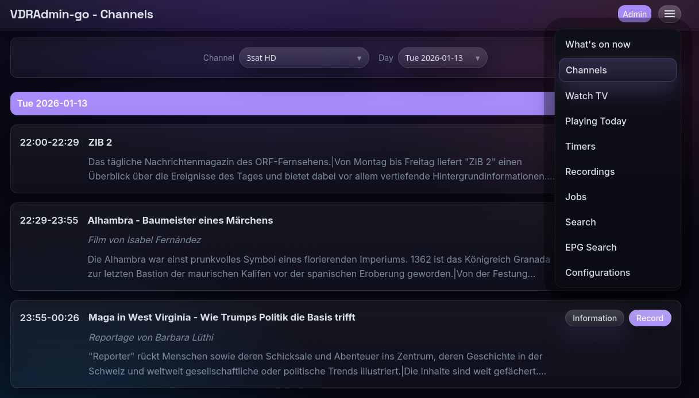
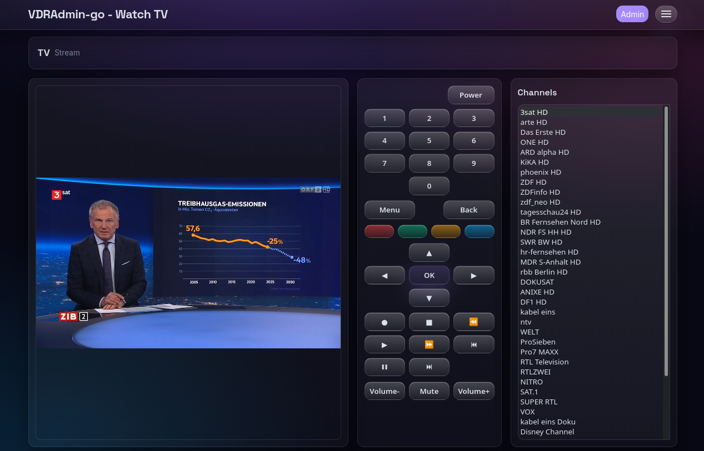

# vdradmin-go

`vdradmin-go` is a web frontend for [VDR](https://tvdr.de/) written in Go using hexagonal architecture, clean code practices, and modern web technologies. It's inspired by [vdradmin-am](http://andreas.vdr-developer.org/vdradmin-am/index.html) but most probably wont implement every feature of `vdradmin-am`. This is really a very opinionated implementation of a VDR web frontend that mainly satisfies my needs ;-)

## Note

I'm using `vdradmin-go` on a daily base and it contains some tests to ensure some quality. Still, the code isn't that mature. Expect bugs. Some features have beta quality, some only alpha quality and some elements might not work at all. So be careful esp. with features that change something on the file system like deleting recordings and things like that!

This code was mainly generated with Claude Code (initial conversion of `vdradmin-am` Perl code to Go) and GPT-5.2 (everything else). Originally, I just wanted to see how far I can get converting the Perl code base of `vdradmin-am` (~7500 lines of code) to Go and more recent technologies. But turned it worked very well and got a useable application at the end.

## Screenshots

### Channels



### Watch TV (Screenshot)



## Goals

- **Modern Architecture**: Hexagonal (ports & adapters) architecture for maintainability
- **Clean Code**: Following Go best practices and SOLID principles
- **Modern UI**: [htmx](https://htmx.org/) for dynamic interactions, modern CSS, minimal JavaScript
- **Type Safety**: Strong typing with comprehensive error handling
- **Performance**: Concurrent operations, efficient caching
- **Security**: Secure authentication, input validation, HTTPS support
- **Observability**: Structured logging, metrics, tracing ready

## Architecture

vdradmin-go follows **Hexagonal Architecture** (Ports & Adapters): the domain and application logic stay independent of transport (HTTP) and integration details (SVDRP). This keeps use cases easy to test and adapters easy to swap.

- **Domain** (`internal/domain`): domain models + domain-specific rules/errors.
- **Application** (`internal/application`): use-cases/services that orchestrate domain logic and call ports.
- **Ports** (`internal/ports`): interfaces the application depends on (e.g. VDR client).
- **Adapters** (`internal/adapters`): concrete implementations of ports.
  - **Primary adapters** (`internal/adapters/primary/http`): HTTP server, handlers, middleware.
  - **Secondary adapters** (`internal/adapters/secondary/svdrp`): SVDRP client integration to talk to VDR.
- **Infrastructure** (`internal/infrastructure`): cross-cutting concerns like configuration.
- **Web UI assets** (`web/templates`, `web/static`): server-rendered templates + htmx + CSS/JS.

Typical request flow:

```plain
HTTP request → handler (primary adapter) → application service → port interface → secondary adapter (SVDRP) → VDR
```

For a detailed overview (including more diagrams and examples), see `docs/ARCHITECTURE.md`.

```plain
vdradmin-go/
├── cmd/
│   └── vdradmin/                # Application entry point (main)
├── internal/
│   ├── domain/                  # Domain models + domain errors
│   ├── ports/                   # Port interfaces (e.g. VDR client)
│   ├── application/             # Use cases / orchestration
│   │   ├── services/            # EPG, timers, recordings, autotimers
│   │   └── archive/             # Recording archive jobs
│   ├── adapters/                # Adapter implementations
│   │   ├── primary/http/        # HTTP server, handlers, middleware, HLS proxy
│   │   └── secondary/svdrp/     # SVDRP integration to talk to VDR
│   ├── infrastructure/
│   │   └── config/              # Config loading + validation
│   └── integration/             # Container-based integration tests
├── web/
│   ├── templates/               # HTML templates
│   └── static/                  # Frontend assets
│       ├── css/
│       └── js/
├── configs/                     # Example configuration(s)
├── deployments/                 # Docker + systemd
├── test/                        # Integration test assets (e.g. svdrpstub)
├── scripts/                     # Helper scripts
├── docs/                        # Documentation (see docs/ARCHITECTURE.md)
├── screenshots/                 # UI screenshots
├── build/                       # Local build output (make build)
├── dist/                        # GoReleaser output (local)
├── go.mod
├── go.sum
├── Makefile
└── README.md
```

## Technology Stack

- **Language**: Go 1.25+
- **Web**: Go 1.22+ internal router
- **Templates**: html/template
- **Config**: YAML with validation
- **Logging**: slog (stdlib)
- **Frontend**: htmx + modern CSS

## Requirements

### Core requirements (always)

- A running **VDR** instance you can reach from where `vdradmin-go` runs.
- **SVDRP access** to that VDR (host/port and credentials depending on your setup).
- Basic network connectivity between `vdradmin-go` and VDR.
- Some features require that `vdradmin-go` runs on the same host as VDR.
- `config.yaml` needs to be writeable by the user `vdradmin-go` process uses (e.g. `vdr`) if you make changes via the UI.

### Build from source ("make run" / "make build")

- **Go 1.25+** (see `go.mod`). If your distro packages an older Go version, install Go from [go.dev/dl](https://go.dev/dl/).
- `make` and `git`.

Arch Linux:

```bash
sudo pacman -Syu
sudo pacman -S --needed go make git
```

### Using the released binary

- No build toolchain needed.

### Docker / docker-compose

- Docker Engine.
- For `docker compose`, install the Docker Compose plugin.
- Ensure the container can reach your VDR (networking/hostnames/firewalls).

Arch Linux:

```bash
sudo pacman -Syu
sudo pacman -S --needed docker docker-compose
```

### systemd service

- A Linux system with `systemd`.
- A suitable place for the binary and config file, and correct permissions for the service user.

### Feature-specific requirements (optional)

- **Archive recordings** (`/recordings` → Archive): requires `ffmpeg` on the `vdradmin-go` host; optional `ffprobe` for percentage progress.
- **Watch TV snapshots** (`/watch`): requires a VDR setup where the SVDRP `GRAB` command works (often not available on headless/recording-only setups).
- **Watch TV streaming** (HLS proxy mode): requires a stream source (commonly `vdr-plugin-streamdev-server`) and `ffmpeg` on the `vdradmin-go` host.
- **EPGSearch-related pages/features**: typically require the VDR `epgsearch` plugin (package names vary by distro).

Arch Linux:

```bash
sudo pacman -S --needed ffmpeg
yay -S vdr-streamdev-server vdr-epgsearch
```

## Quick Start

```bash
# Build
make run
```

Open URL `http://127.0.0.1:8080` in your browser. Use default username `admin` and password `admin`. Some actions in the UI will cause creating a `config.yaml` in the current directory to store the state.

## Usage / Deployment Options

`vdradmin-go` can be run in multiple ways depending on your setup.

Releases are built via GitHub Actions (GoReleaser) when a semantic version tag is pushed (e.g. `0.1.0` or `0.1.0-rc.1`).

### 1) Use the released binary

- Download the `linux_amd64` archive from the latest [GitHub Release](https://github.com/githubixx/vdradmin-go/releases). E.g.:

```bash
export VDRADMIN_GO_VERSION="0.2.1"

wget https://github.com/githubixx/vdradmin-go/releases/download/${VDRADMIN_GO_VERSION}/vdradmin-go_${VDRADMIN_GO_VERSION}_linux_amd64.tar.gz
```

- Extract it

```bash
tar xvfz vdradmin-go_${VDRADMIN_GO_VERSION}_linux_amd64.tar.gz
```

- Run it with default settings:

```bash
./vdradmin
```

- Or with a configuration file

```bash
./vdradmin --config /path/to/config.yaml
```

### 2) Use the Docker container (GHCR)

- Check for latest version in [Github Container Registry (GHCR)](https://github.com/githubixx/vdradmin-go/releases)

- Pull the image from GitHub Container Registry:

```bash
export VDRADMIN_GO_VERSION="0.2.1"

docker pull ghcr.io/githubixx/vdradmin-go:${VDRADMIN_GO_VERSION}
```

- Run the container:

```bash
docker run \
  --rm -p 8080:8080 \
  -v "${PWD}/config.yaml:/app/config.yaml" \
  ghcr.io/githubixx/vdradmin-go:${VDRADMIN_GO_VERSION}
```

- Run the container (also mount your VDR recordings directory):

Make sure `vdr.video_dir` in your `config.yaml` matches the container path (example below uses `/var/lib/video.00`).

```bash
docker run \
  --rm -p 8080:8080 \
  -v "${PWD}/config.yaml:/app/config.yaml" \
  -v "/var/lib/video.00:/var/lib/video.00" \
  ghcr.io/githubixx/vdradmin-go:${VDRADMIN_GO_VERSION}
```

### 3) Run as a systemd service

If you want vdradmin-go to start automatically on boot:

1. Copy the example unit file from `deployments/systemd/vdradmin.service` to your systemd directory.
2. Install the `vdradmin` binary somewhere like `/usr/local/bin/vdradmin`.
3. Ensure the unit points to your config path.
4. Enable and start:

```bash
sudo systemctl daemon-reload
sudo systemctl enable --now vdradmin
```

### 4) Use docker-compose

There is an example compose file at `deployments/docker-compose.yml`.
Typically you will:

- set the image to `ghcr.io/githubixx/vdradmin-go:${VDRADMIN_GO_VERSION}` (check for latest version in [Github Container Registry (GHCR)](https://github.com/githubixx/vdradmin-go/releases))
- mount your `config.yaml` into the container

Then run:

```bash
docker compose -f deployments/docker-compose.yml up -d
```

## Configuration

See `configs/config.example.yaml` for full configuration options.

## Archive recordings

The **Recordings** page (`/recordings`) includes an **Archive** action (admin-only) that remuxes a VDR recording directory (multiple `*.ts` segments) into a single `video.(mkv|mp4)` inside `archive.base_dir`.

Requirements:

- `ffmpeg` installed on the `vdradmin-go` host
- Optional (for percentage progress): `ffprobe`

Configuration:

- `archive.base_dir`: absolute output directory root
- `archive.profiles`: optional list of destination profiles (movie/series) so you can add more archive directories or customize defaults
- `archive.ffmpeg_args`: additional ffmpeg output args (defaults are hardware-accel friendly for AMD GPUs but can be changed)

Safety defaults:

- keeps originals
- runs in background
- refuses to overwrite an existing output file

## Watch TV

The **Watch TV** page (`/watch`) provides:

- a periodically refreshed **snapshot** (configurable interval + size)
- a **remote control** (SVDRP `HITK`)
- a **channel list** restricted to channels configured in **Configurations** (wanted channels)

### Snapshot requirements

The snapshot feature uses the SVDRP `GRAB` command.

- If your VDR does not support `GRAB` (or cannot grab a picture on the VDR host), the page will still load but snapshots will fail. This is common for headless/recording-only VDR instances that have tuners but no primary video output/decoder device.

For troubleshooting and background, see `docs/WATCHTV.md`.

### Optional: stream URL mode (headless setups)

If you run VDR headless (recording-only) and `GRAB` cannot work, you can enable streaming for `/watch`.

#### Recommended: HLS proxy (built-in transcoding)

Configure `vdr.streamdev_backend_url` in Configurations:

- Example: `http://127.0.0.1:3000/{channel}`
- Requires: `ffmpeg` installed on the `vdradmin-go` host
- Requires: Suitable plugin like `vdr-plugin-streamdev-server`
- `vdradmin-go` will transcode streamdev MPEG-TS to browser-playable HLS automatically
- `/watch` uses internal proxy endpoint `/watch/stream/{channel}/index.m3u8`

#### Alternative: Direct external stream URL

- Configure `vdr.stream_url_template` if you have a pre-existing HLS/MJPEG/WebM endpoint
- The template may contain `{channel}`, which will be replaced with the selected VDR channel **number** (e.g. `1`, `2`, `3`).
- `/watch` embeds the URL into an HTML5 `<video>` element. The URL must point to a format your browser can play (for example HLS `.m3u8` or a browser-supported MP4/WebM stream).

If you use `vdr-plugin-streamdev-server`, its HTTP server commonly runs on port `3000` and can serve channels by number, e.g. `http://127.0.0.1:3000/1`.

Note: streamdev’s default outputs are typically TS/PES/ES, which most browsers do not play directly; you may need an external remux/transcode step to get true in-browser playback.

## Integration Tests (Docker)

There is an optional integration test (build tag `integration`) that spins up:

- an SVDRP stub container (fake VDR)
- a `vdradmin-go` container (to mimic real deployment)

and asserts that `/timers` renders the timer timeline with `ok`/`collision`/`critical` blocks.

```bash
# Requires Docker
go test -tags=integration ./internal/integration -run TestContainers -count=1

# Optional: reuse a prebuilt app image (faster)
docker build -f deployments/Dockerfile -t vdradmin-go-it-app:local .
VDRADMIN_GO_APP_IMAGE=vdradmin-go-it-app:local \
  go test -tags=integration ./internal/integration -run TestContainers -count=1
```

## License

LGPL v2.1 (same as original [vdradmin-am](http://andreas.vdr-developer.org/vdradmin-am/index.html))
